# Cost Cup — Player Archetypes + Transitions (Dash + SQL)

## What this project does
Hockey performance metrics are noisy and heavily influenced by **team context**, deployment, and game state.  
Instead of modeling players as a single “skill number,” this project models:

1) **Player roles (archetypes)** using **KMeans clustering** on **even-strength**, rate-based features  
2) **Role transitions** across seasons using **smoothed transition probabilities** (Dirichlet shrinkage)  
3) A **Dash dashboard** to explore team composition, player gamelogs, and what-if swaps  

This supports questions like:
- What archetype mix does a team have this season?
- If we swap one player for another, how does the role composition change?
- Given a player’s current archetype, what is the probability they shift archetypes next season?

## Key idea (theory)
Player “roles” can be more stable and interpretable than raw performance, especially when we focus on:
- **Even-strength (ES)** only (reduces PP/PK confounding)
- **Rate-based features** (reduces TOI bias)
- **Robust / capped metrics** (reduces extreme-event distortion)

## Repo guide (minimal disruption)
- `README.md` → short story + how to run
- `docs/PROJECT_STORY.md` → long narrative + SQL patterns + edge cases + diagrams
- `notebooks/00_project_story.ipynb` → walkthrough + required visualizations
- `sql/sanity/modern/` → sanity queries we actually run
- `dash_app/` → dashboard code

---

## Running the dashboard (local)
From repo root:

```bash
export APP_ENV=aws   # or local
python -m dash_app.app
# open http://127.0.0.1:8050
```
md
> Note: database credentials and environment-specific deployment settings are intentionally excluded from this repo.
> Access to hosted data is provided separately when required.

⸻

## Pipelines (high level)

Raw data is transformed into stable, queryable tables that drive both modeling and the dashboard:

Raw data
→ identity resolution / normalization
→ player-game ES truth features (Postgres)
→ player-season features (SQL)
→ clean/cap modeling dataset (SQL)
→ KMeans archetypes (Python; F/D separately)
→ transition counts + Dirichlet smoothing
→ Dash dashboard (tabs 1/2/3)

Full details (including SQL patterns and edge-case tables) live in:
	-	docs/PROJECT_STORY.md
	-	notebooks/00_project_story.ipynb

⸻

## Pipelines (SQL-first orchestration)

This project is intentionally SQL-first: most transformations are implemented as SQL scripts and stored procedures in Postgres, and Python is used primarily to orchestrate execution and run the KMeans clustering step.

### Modern archetypes pipeline (end-to-end)

Driver: scripts/run_modern_archetypes_pipeline.py (name may vary)

### Stages

1. **Player-game ES truth features (per season)**
   - `CALL mart.build_player_game_features_truth(<season>);`

2. **Player-season aggregation (per season)**
   - `sql/mart/player_season_features_modern_truth.sql`

3. **Archetype feature table (all seasons)**
   - `sql/mart/player_season_archetype_features_modern_truth.sql`

4. **Cleaning / stabilization layer (all seasons)**
   - `sql/mart/player_season_archetype_features_modern_truth_clean.sql`
   - Validate: `to_regclass('mart.player_season_archetype_features_modern_truth_clean')`

5. **KMeans clustering (Python step)**
   - `python cluster_player_archetypes_modern.py --position F`
   - `python cluster_player_archetypes_modern.py --position D`

6. **Transitions + Dirichlet smoothing (statistical model)**
   - Transition matrices:
     - `mart.cluster_transitions_modern_f`
     - `mart.cluster_transitions_modern_d`
   - Per-player next-cluster probabilities:
     - `mart.cluster_transition_model_probs_f`
     - `mart.cluster_transition_model_probs_d`


Run it
bash
python scripts/run_modern_archetypes_pipeline.py \
  --dsn "host=... port=5432 dbname=hockey_stats user=... password=... sslmode=require"

⸻

## Data lineage (what tables mean)

We separate tables by purpose:

- **Truth / base tables (game grain)**  
  - `mart.player_game_features_<season>_truth`  
  - Grain: one row per `(game_id, player_id, team_id)`  
  - Foundation for season aggregation + dashboard gamelog queries

- **Modeling dataset (season grain)**  
  - `mart.player_season_archetype_features_modern_truth_clean`  
  - Cleaned/capped dataset with standardized modeling rules (audit-friendly)

- **Cluster outputs**  
  - `mart.player_season_clusters_modern_truth_f` / `_d`  
  - `mart.player_cluster_centers_modern_truth_f` / `_d`

- **Dash views (presentation)**  
  - `mart.v_player_season_archetypes_modern_regulars`  
  - Verified: **regulars is a strict subset of `modern_v2`**, and **cluster assignments match exactly on the overlap**.

## Pipeline map (modern seasons)

```mermaid
flowchart LR
  A["Stored proc: mart.build_player_game_features_truth(season)"] --> B["player_game_features_<season>_truth"]
  B --> C["SQL: player_season_features_modern_truth.sql (per-season)"]
  C --> D["SQL: player_season_archetype_features_modern_truth.sql (all seasons)"]
  D --> E["SQL: player_season_archetype_features_modern_truth_clean.sql (clean + caps)"]
  E --> F["Python: cluster_player_archetypes_modern.py (KMeans K=3 per F/D)"]
  F --> G["Archetype outputs (views/tables in mart + dashboard)"]
```



### Execution order (as implemented)

For each season in `SEASONS_MODERN`:
1. `CALL mart.build_player_game_features_truth(season);` *(optional, can skip)*
2. `psql -v season=<season> -f sql/mart/player_season_features_modern_truth.sql`

Then (once):
3. `psql -f sql/mart/player_season_archetype_features_modern_truth.sql`
4. `psql -f sql/mart/player_season_archetype_features_modern_truth_clean.sql`
5. `python cluster_player_archetypes_modern.py --position F`
6. `python cluster_player_archetypes_modern.py --position D`

| Stage | Implementation | Why it matters |
|---|---|---|
| Player-game truth (ES features) | Postgres stored procedure | Fast, consistent base table at grain `(game_id, player_id, team_id)` |
| Player-season aggregation | SQL scripts | Reproducible transformations close to the data (easy to audit) |
| Cleaning / capping | SQL scripts | Centralized modeling rules (outliers, caps, null handling) |
| KMeans archetypes (F/D) | Python (scikit-learn) + SQL outputs | Learns roles from standardized features; stores clusters + centers for dashboard/modeling |
| Transitions + Dirichlet smoothing | SQL (+ optional Python) | Stabilizes sparse transitions into usable probabilities (avoids brittle 0%/100%) |

